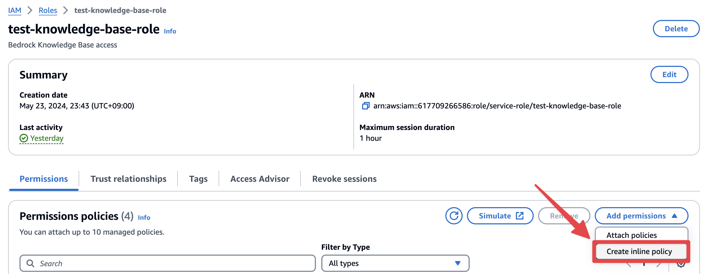

# 가장 손쉬운 RAG 구현을 위한 Amazon Bedrock - Knowledge Base 생성과 쿼리 및 답변 생성을 위한 AWS Lambda 구성하기

## Architecture


## Overview

예를 들어, 아래와 같은 자료 검색 플랫폼을 구축한다고 가정해봅시다. 이때, 필요한 기능은 [1] 자료의 내용이 임베딩되여 저장되어 있어 이를 기반으로 검색할 수 있는 기능, [2] 사용자의 질문에 자료에서 발췌된 내용을 기반으로 LLM이 답변을 생성하는 기능(RAG)이 필요합니다.


이러한 기능 구현을 위해 [Amazon Bedrock - Knowledge base](https://aws.amazon.com/ko/bedrock/knowledge-bases/)를 사용할 수 있습니다. Knowledge base는 (1) 연결된 데이터 소스에 저장된 자료에 대하여 임베딩을 수행합니다. (2) 임베딩된 벡터를 Amazon OpenSearch와 같은 연결된 벡터 스토어에 저장하여 검색 가능하도록 합니다. (3) 사용자가 위 [1], [2]의 기능을 이용할 수 있도록 자료검색을 위해 [1] [**Retrieve API**](https://docs.aws.amazon.com/ko_kr/bedrock/latest/APIReference/API_agent-runtime_Retrieve.html)와 제공되는 LLM을 기반으로 [2] [**RetrieveAndGenerate API**](https://docs.aws.amazon.com/ko_kr/bedrock/latest/APIReference/API_agent-runtime_RetrieveAndGenerate.html)를 제공합니다.

해당 가이드에서는 이러한 Knowledge base를 구성하는 방법과 제공되는 API를 활용하는 방법을 가이드합니다.

> 💡 해당 가이드는 자료가 저장될 Amazon S3 버킷과 Amazon Bedrock - Knowledge Base를 버지니아 북부(us-east-1)에서 생성하고 이를 호출하는 AWS Lambda를 서울(ap-northeast-2)에서 생성하는 방법을 가이드합니다.

## Data Source로 사용할 S3 버킷 생성하기

> ⚠️ Knowledge Base와 연결되는 Data Source(S3)는 같은 리전이어야 합니다. (Bedrock이 us-east-1이라면 S3 버킷 또한 us-east-1으로 리전이 설정된 버킷만 사용할 수 있습니다.)

1. S3 버킷 생성
    1. [해당 링크](https://us-east-1.console.aws.amazon.com/s3/bucket/create?region=us-east-1)를 클릭하여 버킷을 생성합니다.
    2. 리전을 확인하고 버킷 명을 입력합니다.

       

2. 나머지 설정은 그대로 두고 [Create bucket]을 클릭하여 버킷을 생성합니다.

---

## [Amazon Bedrock Knowledge base 생성](https://us-east-1.console.aws.amazon.com/bedrock/home?region=us-east-1#/knowledge-bases)하기

1. Amazon Bedrock 콘솔에서 Knowledge bases 선택, 후 [Create knowledge base] 클릭합니다.

   

2. **Knowledge base name 입력하고** [IAM permissions] 부분의 [Create and use a new service role] 선택 후, 역할 이름을 입력 후, 별도 기록합니다. (이후, 권한을 수정하여야합니다.)

   

3. [Next] 클릭하고 [**Data source name**]과 [**S3 URI**]를 입력합니다. S3 URI는 **`s3://생성한_버킷명`** 입니다.

   > ⚠️ 설정한 S3 URI를 기준으로 Sync를 수행합니다. Sync 작업에는 자료에 대한 임베딩 작업을 진행한 후, 결과인 벡터를 Vector Store에 저장하는 과정을 포함합니다. 특정 폴더만을 Sync하고 싶다면 싶으면 추가로 Path를 입력합니다.

   

4. [**Embeddings model - Titan Embeddings G1 Text**]과 [Vector database]를 선택합니다.

   

5. 설정 값 리뷰 이후, [Create knowledge base]를 클릭하여 생성합니다. (약 10 - 20분 소요됩니다.)

---

## Knowledge base를 위한 IAM 역할 설정하기

1. [IAM 역할 콘솔](https://us-east-1.console.aws.amazon.com/iam/home?region=us-east-1#/roles)로 이동합니다.
2. 검색 창에 위에서 생성된 Knowledge base Role의 이름을 입력합니다.
3. 검색된 Role을 클릭하고 [Permissions]탭에서 [Add permissions] - [Create inline policy]를 클릭합니다.

   

4. [JSON] 토글을 클릭하고 아래와 같이 Knowledge base의 S3를 위한 권한을 구성합니다.

   > ⚠️ `YOUR_BUCKET_NAME`, `YOUR_ACCOUNT_ID`를 변경하여야 합니다. `YOUR_ACCOUNT_ID`는 콘솔의 우측 상단에 있는 ‘-’을 제외한 12자리 숫자입니다.

    ```json
    {
        "Version": "2012-10-17",
        "Statement": [{
            "Effect": "Allow",
            "Action": [
                "s3:GetObject",
                "s3:ListBucket"
            ],
            "Resource": [
                "arn:aws:s3:::YOUR_BUCKET_NAME",
                "arn:aws:s3:::YOUR_BUCKET_NAME/*"
            ],
            "Condition": {
                "StringEquals": {
                    "aws:PrincipalAccount": "YOUR_ACCOUNT_ID"
                }
            }
        }]
    }
    ```

   

5. 이후, Policy name은 `access-to-s3-policy`로 지정하고 [Create policy]를 클릭하여 생성합니다.
6. Knowledge base 콘솔에서 테스트하기
    1. 1.에서 생성한 S3 버킷에 [지원 파일 형식에 맞는 자료](https://docs.aws.amazon.com/ko_kr/bedrock/latest/userguide/knowledge-base-ds.html#kb-ds-metadata)를 업로드합니다.

       

    2. [Bedrock - Knowledge base 콘솔](https://us-east-1.console.aws.amazon.com/bedrock/home?region=us-east-1#/knowledge-bases)로 이동하여 생성된 Knowledge base를 확인합니다.
    3. [Data source] 항목에서 생성한 Data source를 선택하고 [Sync] 버튼을 클릭합니다.

       

    4. Sync 작업이 완료되면 우측 [Test knowledge base] 패널에서 [Select model]을 클릭하여 응답을 생성할 모델을 선택합니다.

       

    5. 예시) [산업안전보건법에 대한 PDF](https://www.law.go.kr/LSW/lsInfoP.do?lsiSeq=253521&lsId=001766&chrClsCd=010202&urlMode=lsInfoP#0000)를 업로드 한 후, `건설공사`에 대해서 질의한 결과

       


---

## 동작 방식 이해하기

1. 이렇게 생성된 Knowledge base를 AWS 콘솔 환경이 아닌 Client에서 사용하기 위해서는 해당 기능의 API를 호출할 수 있어야합니다.
2. 이에 대한 API는 두가지를 제공합니다.
    1. Knowledge base에 쿼리하여 검색된 자료에 대한 정보를 받아올 수 있는 [**Retrieve API**](https://docs.aws.amazon.com/ko_kr/bedrock/latest/APIReference/API_agent-runtime_Retrieve.html)입니다.
    2. Knowledge base에 쿼리하고 검색된 결과를 기반으로 선택한 LLM을 통해 응답까지를 생성하는 [**RetrieveAndGenerate API**](https://docs.aws.amazon.com/ko_kr/bedrock/latest/APIReference/API_agent-runtime_RetrieveAndGenerate.html)입니다. 응답은 쿼리와 관련된 소스만 인용합니다.
3. 아래와 같이 자료 검색 플랫폼을 개발하여야 한다고 가정해보겠습니다.

   

   만약, 위와 같은 자료 검색 플랫폼을 만든다면, **`🤖 Generated Answer...`** 부분의 기능을 위해서는 [**RetrieveAndGenerate API**](https://docs.aws.amazon.com/ko_kr/bedrock/latest/APIReference/API_agent-runtime_RetrieveAndGenerate.html), 아래 `Search Result...`부분을 위해서는 [**Retrieve API**](https://docs.aws.amazon.com/ko_kr/bedrock/latest/APIReference/API_agent-runtime_Retrieve.html)가 필요하게 됩니다.

   > ⚠️ 물론 [**RetrieveAndGenerate API**](https://docs.aws.amazon.com/ko_kr/bedrock/latest/APIReference/API_agent-runtime_RetrieveAndGenerate.html)에도 인용한 자료에 대한 내용도 나오지만 일반적인 질문에 대한 유사도(벡터 근접도) 기반으로 자료 검색 결과 리스트를 받기 위해서는 [**Retrieve API**](https://docs.aws.amazon.com/ko_kr/bedrock/latest/APIReference/API_agent-runtime_Retrieve.html)를 사용하여야 합니다.

4. 이러한 API를 사용하기 위해 개발단계에서의 편의성을 위해 언어 및 프레임워크에서 제공하는 [AWS SDK](https://aws.amazon.com/ko/what-is/sdk/)를 활용하거나 [Amazon Bedrock with LangChain](https://python.langchain.com/v0.1/docs/integrations/llms/bedrock/) 등을 활용할 수 있습니다.
5. 해당 가이드에서는 **AWS Lambda**에서 [**Python SDK**](https://boto3.amazonaws.com/v1/documentation/api/latest/reference/services/bedrock-agent-runtime/client/retrieve_and_generate.html)를 사용하여 [**RetrieveAndGenerate API**](https://docs.aws.amazon.com/ko_kr/bedrock/latest/APIReference/API_agent-runtime_RetrieveAndGenerate.html)을 호출하도록 구성하여 사용자의 질문에 RAG 기반의 답변을 생성하는 기능을 구현합니다.

---

## **AWS Lambda를 통해 서울(ap-northeast-2) 리전에서 Knowledge base로 쿼리&생성**

> ⚠️ AWS Lambda의 리전을 꼭 서울(ap-northeast-2)으로 해야하는 것은 아닙니다. [**RetrieveAndGenerate API**](https://docs.aws.amazon.com/ko_kr/bedrock/latest/APIReference/API_agent-runtime_RetrieveAndGenerate.html) 호출하고자 하는 리전에서 AWS Lambda를 생성하면 됩니다.

1. [AWS Lambda 콘솔](ap-northeast-2.console.aws.amazon.com/lambda/home?region=ap-northeast-2#/create/function)로 이동합니다.
2. 함수 이름을 입력하고 [Runtime]은 Python 3.12를 선택합니다. [Permissions] 섹션의 [Execution role]을 [Create a new role with basic Lambda permissions]으로 선택합니다. (함수의 실행 역할입니다. 이후, [RetrieveAndGenerate API](https://docs.aws.amazon.com/ko_kr/bedrock/latest/APIReference/API_agent-runtime_RetrieveAndGenerate.html)에 대한 권한을 추가합니다.)

   

3. 함수의 코드 편집기에서 아래 코드를 입력하고 변경해야하는 부분을 확인 후, [Deploy]를 클릭하여 배포합니다.

   > ⚠️ 아래 코드는 Claude 3 Sonnet을 사용하는 코드 예시입니다. 다른 모델을 사용하고자 하는 경우 [해당 기능](https://docs.aws.amazon.com/ko_kr/bedrock/latest/userguide/models-get-info.html)을 통해 사용하고자하는 모델의 ARN으로 아래 `modelArn` 부분을 변경해주세요. 또한 `YOUR_KNOWLEDGE_BASE_ID` 을 위에서 생성한 Knowledge Base ID로 변경해주세요. (*아래 스크린샷 참고)

   

    ```python
    import boto3
    import json
    
    def lambda_handler(event, context):
        client = boto3.client('bedrock-agent-runtime', region_name='us-east-1')
        
        session_id = event.get('sessionId', None)
        
        # https://boto3.amazonaws.com/v1/documentation/api/latest/reference/services/bedrock-agent-runtime/client/retrieve_and_generate.html
        
        input_data = {
            'input': {
                'text': event['query']
            },
            'retrieveAndGenerateConfiguration': {
                'knowledgeBaseConfiguration': {
                    'knowledgeBaseId': 'YOUR_KNOWLEDGE_BASE_ID',
                    'modelArn': 'arn:aws:bedrock:us-east-1::foundation-model/anthropic.claude-3-sonnet-20240229-v1:0'
                },
                'type': 'KNOWLEDGE_BASE'
            }
        }
        
        # SessionId가 있는 경우 추가
        if session_id:
            input_data['sessionId'] = session_id
        
        print(input_data)
        
        response = client.retrieve_and_generate(**input_data)
        
        return response
    
    ```

4. Lambda 함수 실행 시간 수정
    1. 함수의 [Configuration] 탭의 [General configuration] 탭에서 실행 Timeout을 기존 3초에서 1분 정도로 조정하여 줍니다.

       

5. Lambda 함수 Execution Role 권한 수정
    1. 함수의 [Configuration] 탭의 [Permissions] 탭에서 함수에 연결된 Role name을 클릭합니다.

       

    2. [Permissions]탭에서 [Add permissions] - [Create inline policy]를 클릭합니다.
    3. [JSON] 토글을 클릭하고 아래 코드를 참조하여 모델과 Knowledge base에 대한 권한을 입력합니다.

       > ⚠️ `YOUR_KNOWLEDGE_BASE_ID`, `YOUR_ACCOUNT_ID`를 변경하여야 합니다. `YOUR_ACCOUNT_ID`는 콘솔의 우측 상단에 있는 ‘-’을 제외한 12자리 숫자입니다.

        ```json
        {
        	"Version": "2012-10-17",
        	"Statement": [
        		{
        			"Sid": "InvokeModel",
        			"Effect": "Allow",
        			"Action": "bedrock:InvokeModel",
        			"Resource": "arn:aws:bedrock:us-east-1::foundation-model/anthropic.claude-3-sonnet-20240229-v1:0"
        		},
        		{
        			"Sid": "QueryToKnowledgeBases",
        			"Effect": "Allow",
        			"Action": [
        				"bedrock:Retrieve",
        				"bedrock:RetrieveAndGenerate"
        			],
        			"Resource": [
        				"arn:aws:bedrock:us-east-1:YOUR_ACCOUNT_ID:knowledge-base/YOUR_KNOWLEDGE_BASE_ID"
        			]
        		}
        	]
        }
        ```

    4. Policy name은 `query-to-knowledgebase-policy` 을 입력하고 [Create policy]를 클릭하여 생성합니다.

       


---

## Lambda 함수 테스트

1. 함수의 [Code] 탭에서 [Test] 버튼을 클릭합니다.
2. Event name과 아래 JSON처럼 질문을 입력합니다.

   

    ```json
    {
        "query": "건설공사란?"
    }
    ```

3. Save 후, 다시 [Test] 버튼을 클릭하고 결과를 확인합니다.

   ### 응답 예시

    ```json
    {
      "ResponseMetadata": ...
      "sessionId": "YOUR_SESSION_ID",
      "output": {
        "text": "건설공사란 다음 각 목의 어느 하나에 해당하는 공사를 말합니다:\n가. 「건설산업기본법」 제2조제4호에 따른 건설공사\n나. 「전기공사업법」 제2조제1호에 따른 전기공사\n다. 「정보통신공사업법」 제2조제2호에 따른 정보통신공사\n라. 「소방시설공사업법」에 따른 소방시설공사\n마. 「국가유산수리 등에 관한 법률」에 따른 국가유산 수리공사"
      },
      "citations": [
        {
          "generatedResponsePart": {
            "textResponsePart": {
              "text": "건설공사란 다음 각 목의 어느 하나에 해당하는 공사를 말합니다:\n가. 「건설산업기본법」 제2조제4호에 따른 건설공사\n나. 「전기공사업법」 제2조제1호에 따른 전기공사\n다. 「정보통신공사업법」 제2조제2호에 따른 정보통신공사\n라. 「소방시설공사업법」에 따른 소방시설공사\n마. 「국가유산수리 등에 관한 법률」에 따른 국가유산 수리공사",
              "span": {
                "start": 0,
                "end": 183
              }
            }
          },
          "retrievedReferences": [
            {
              "content": {
                "text": "“산업재해”란 노무를 제공하는 사람이 업무에 관계되는 건설물ㆍ설비ㆍ원재료ㆍ가스ㆍ증기ㆍ분진 등에 의하거   나 작업 또는 그 밖의 업무로 인하여 사망 또는 부상하거나 질병에 걸리는 것을 말한다.   2. “중대재해”란 산업재해 중 사망 등 재해 정도가 심하거나 다수의 재해자가 발생한 경우로서 고용노동부령으로 정   하는 재해를 말한다.   3. “근로자”란 「근로기준법」 제2조제1항제1호에 따른 근로자를 말한다.   4. “사업주”란 근로자를 사용하여 사업을 하는 자를 말한다.   5. “근로자대표”란 근로자의 과반수로 조직된 노동조합이 있는 경우에는 그 노동조합을, 근로자의 과반수로 조직된   노동조합이 없는 경우에는 근로자의 과반수를 대표하는 자를 말한다.   6. “도급”이란 명칭에 관계없이 물건의 제조ㆍ건설ㆍ수리 또는 서비스의 제공, 그 밖의 업무를 타인에게 맡기는 계   약을 말한다.   7. “도급인”이란 물건의 제조ㆍ건설ㆍ수리 또는 서비스의 제공, 그 밖의 업무를 도급하는 사업주를 말한다. 다만, 건   설공사발주자는 제외한다.   8. “수급인”이란 도급인으로부터 물건의 제조ㆍ건설ㆍ수리 또는 서비스의 제공, 그 밖의 업무를 도급받은 사업주를   말한다.   9. “관계수급인”이란 도급이 여러 단계에 걸쳐 체결된 경우에 각 단계별로 도급받은 사업주 전부를 말한다.   10. “건설공사발주자”란 건설공사를 도급하는 자로서 건설공사의 시공을 주도하여 총괄ㆍ관리하지 아니하는 자를   말한다. 다만, 도급받은 건설공사를 다시 도급하는 자는 제외한다.   11. “건설공사”란 다음 각 목의 어느 하나에 해당하는 공사를 말한다.   가. 「건설산업기본법」 제2조제4호에 따른 건설공사   나. 「전기공사업법」 제2조제1호에 따른 전기공사   다. 「정보통신공사업법」 제2조제2호에 따른 정보통신공사   라. 「소방시설공사업법」에 따른 소방시설공사   마. 「국가유산수리 등에 관한 법률」에 따른 국가유산 수리공사   12."
              },
              "location": {
                "type": "S3",
                "s3Location": {
                  "uri": "s3://YOUR_S3_BUCKET/test.pdf"
                }
              }
            }
          ]
        }
      ]
    }
    
    ```

4. 요청에 SessionId를 추가하여 대화가 이어지는지 확인합니다.

    ```json
    {
        "query": "이해가 안됩니다. 더 쉽게 설명해주세요.",
        "sessionId": "YOUR_SESSION_ID"
    }
    ```

   ### 응답 예시

    ```json
    {
      "ResponseMetadata": ...
      "sessionId": "YOUR_SESSION_ID",
      "output": {
        "text": "건설공사란 건축, 토목, 전기, 정보통신, 소방시설 등의 공사를 말합니다. 건설공사는 계획, 설계, 시공 단계로 이루어집니다. 건설공사발주자는 각 단계에서 안전보건대장을 작성하고 유해위험요인을 관리해야 합니다. 또한 공사기간을 임의로 단축하거나 위험한 공법을 사용해서는 안 됩니다. 설계변경이 필요한 경우 전문가 의견을 들어 발주자에게 요청할 수 있습니다. 건설공사 도급 시에는 산업안전보건관리비를 계상해야 하며, 도급인은 수급인에게 작업 관련 안전보건 정보를 제공하고 수급인의 안전조치를 확인해야 합니다. 수급인은 정보 미제공 시 작업을 거부할 수 있습니다. 도급인은 수급인의 법 위반 행위에 대해 시정조치를 요구할 수 있습니다."
      },
      "citations": [
        {
          "generatedResponsePart": {
            "textResponsePart": {
              "text": "건설공사란 건축, 토목, 전기, 정보통신, 소방시설 등의 공사를 말합니다. 건설공사는 계획, 설계, 시공 단계로 이루어집니다. 건설공사발주자는 각 단계에서 안전보건대장을 작성하고 유해위험요인을 관리해야 합니다. 또한 공사기간을 임의로 단축하거나 위험한 공법을 사용해서는 안 됩니다. 설계변경이 필요한 경우 전문가 의견을 들어 발주자에게 요청할 수 있습니다.",
              "span": {
                "start": 0,
                "end": 198
              }
            }
          },
          "retrievedReferences": [
            {
              "content": {
                "text": "제69조(공사기간 단축 및 공법변경 금지) ① 건설공사발주자 또는 건설공사도급인(건설공사발주자로부터 해당 건설공   사를 최초로 도급받은 수급인 또는 건설공사의 시공을 주도하여 총괄ㆍ관리하는 자를 말한다. 이하 이 절에서 같다   )은 설계도서 등에 따라 산정된 공사기간을 단축해서는 아니 된다.        법제처                                                            17                                                       국가법령정보센터   산업안전보건법   ② 건설공사발주자 또는 건설공사도급인은 공사비를 줄이기 위하여 위험성이 있는 공법을 사용하거나 정당한 사유   없이 정해진 공법을 변경해서는 아니 된다.     제70조(건설공사 기간의 연장) ① 건설공사발주자는 다음 각 호의 어느 하나에 해당하는 사유로 건설공사가 지연되어   해당 건설공사도급인이 산업재해 예방을 위하여 공사기간의 연장을 요청하는 경우에는 특별한 사유가 없으면 공사   기간을 연장하여야 한다.   1. 태풍ㆍ홍수 등 악천후, 전쟁ㆍ사변, 지진, 화재, 전염병, 폭동, 그 밖에 계약 당사자가 통제할 수 없는 사태의 발생   등 불가항력의 사유가 있는 경우   2. 건설공사발주자에게 책임이 있는 사유로 착공이 지연되거나 시공이 중단된 경우   ② 건설공사의 관계수급인은 제1항제1호에 해당하는 사유 또는 건설공사도급인에게 책임이 있는 사유로 착공이 지   연되거나 시공이 중단되어 해당 건설공사가 지연된 경우에 산업재해 예방을 위하여 건설공사도급인에게 공사기간   의 연장을 요청할 수 있다. 이 경우 건설공사도급인은 특별한 사유가 없으면 공사기간을 연장하거나 건설공사발주   자에게 그 기간의 연장을 요청하여야 한다.   ③ 제1항 및 제2항에 따른 건설공사 기간의 연장 요청 절차, 그 밖에 필요한 사항은 고용노동부령으로 정한다.     제71조(설계변경의 요청) ① 건설공사도급인은 해당 건설공사 중에 대통령령으로 정하는 가설구조물의 붕괴 등으로 산   업재해가 발생할 위험이 있다고 판단되면 건축ㆍ토목 분야의 전문가 등 대통령령으로 정하는 전문가의 의견을 들어   건설공사발주자에게 해당 건설공사의 설계변경을 요청할 수 있다."
              },
              "location": {
                "type": "S3",
                "s3Location": {
                  "uri": "s3://YOUR_S3_BUCKET/test.pdf"
                }
              }
            },
            {
              "content": {
                "text": "건설공사 계획단계: 해당 건설공사에서 중점적으로 관리하여야 할 유해ㆍ위험요인과 이의 감소방안을 포함한 기   본안전보건대장을 작성할 것   2. 건설공사 설계단계: 제1호에 따른 기본안전보건대장을 설계자에게 제공하고, 설계자로 하여금 유해ㆍ위험요인의   감소방안을 포함한 설계안전보건대장을 작성하게 하고 이를 확인할 것   3. 건설공사 시공단계: 건설공사발주자로부터 건설공사를 최초로 도급받은 수급인에게 제2호에 따른 설계안전보건   대장을 제공하고, 그 수급인에게 이를 반영하여 안전한 작업을 위한 공사안전보건대장을 작성하게 하고 그 이행   여부를 확인할 것   ② 제1항에 따른 건설공사발주자는 대통령령으로 정하는 안전보건 분야의 전문가에게 같은 항 각 호에 따른 대장에   기재된 내용의 적정성 등을 확인받아야 한다.<신설 2021. 5. 18.>   ③ 제1항에 따른 건설공사발주자는 설계자 및 건설공사를 최초로 도급받은 수급인이 건설현장의 안전을 우선적으   로 고려하여 설계ㆍ시공 업무를 수행할 수 있도록 적정한 비용과 기간을 계상ㆍ설정하여야 한다.<신설 2021. 5.   18.>   ④ 제1항 각 호에 따른 대장에 포함되어야 할 구체적인 내용은 고용노동부령으로 정한다.<개정 2021. 5. 18.>     제68조(안전보건조정자) ① 2개 이상의 건설공사를 도급한 건설공사발주자는 그 2개 이상의 건설공사가 같은 장소에서   행해지는 경우에 작업의 혼재로 인하여 발생할 수 있는 산업재해를 예방하기 위하여 건설공사 현장에 안전보건조정   자를 두어야 한다.   ② 제1항에 따라 안전보건조정자를 두어야 하는 건설공사의 금액, 안전보건조정자의 자격ㆍ업무, 선임방법, 그 밖에   필요한 사항은 대통령령으로 정한다.     제69조(공사기간 단축 및 공법변경 금지) ① 건설공사발주자 또는 건설공사도급인(건설공사발주자로부터 해당 건설공   사를 최초로 도급받은 수급인 또는 건설공사의 시공을 주도하여 총괄ㆍ관리하는 자를 말한다."
              },
              "location": {
                "type": "S3",
                "s3Location": {
                  "uri": "s3://YOUR_S3_BUCKET/test.pdf"
                }
              }
            }
          ]
        },
        {
          "generatedResponsePart": {
            "textResponsePart": {
              "text": "건설공사 도급 시에는 산업안전보건관리비를 계상해야 하며, 도급인은 수급인에게 작업 관련 안전보건 정보를 제공하고 수급인의 안전조치를 확인해야 합니다. 수급인은 정보 미제공 시 작업을 거부할 수 있습니다. 도급인은 수급인의 법 위반 행위에 대해 시정조치를 요구할 수 있습니다.",
              "span": {
                "start": 200,
                "end": 352
              }
            }
          },
          "retrievedReferences": [
            {
              "content": {
                "text": "제71조(설계변경의 요청) ① 건설공사도급인은 해당 건설공사 중에 대통령령으로 정하는 가설구조물의 붕괴 등으로 산   업재해가 발생할 위험이 있다고 판단되면 건축ㆍ토목 분야의 전문가 등 대통령령으로 정하는 전문가의 의견을 들어   건설공사발주자에게 해당 건설공사의 설계변경을 요청할 수 있다. 다만, 건설공사발주자가 설계를 포함하여 발주한   경우는 그러하지 아니하다.   ② 제42조제4항 후단에 따라 고용노동부장관으로부터 공사중지 또는 유해위험방지계획서의 변경 명령을 받은 건   설공사도급인은 설계변경이 필요한 경우 건설공사발주자에게 설계변경을 요청할 수 있다.   ③ 건설공사의 관계수급인은 건설공사 중에 제1항에 따른 가설구조물의 붕괴 등으로 산업재해가 발생할 위험이 있   다고 판단되면 제1항에 따른 전문가의 의견을 들어 건설공사도급인에게 해당 건설공사의 설계변경을 요청할 수 있   다. 이 경우 건설공사도급인은 그 요청받은 내용이 기술적으로 적용이 불가능한 명백한 경우가 아니면 이를 반영하   여 해당 건설공사의 설계를 변경하거나 건설공사발주자에게 설계변경을 요청하여야 한다.   ④ 제1항부터 제3항까지의 규정에 따라 설계변경 요청을 받은 건설공사발주자는 그 요청받은 내용이 기술적으로   적용이 불가능한 명백한 경우가 아니면 이를 반영하여 설계를 변경하여야 한다.   ⑤ 제1항부터 제3항까지의 규정에 따른 설계변경의 요청 절차ㆍ방법, 그 밖에 필요한 사항은 고용노동부령으로 정   한다. 이 경우 미리 국토교통부장관과 협의하여야 한다.     제72조(건설공사 등의 산업안전보건관리비 계상 등) ① 건설공사발주자가 도급계약을 체결하거나 건설공사의 시공을   주도하여 총괄ㆍ관리하는 자(건설공사발주자로부터 건설공사를 최초로 도급받은 수급인은 제외한다)가 건설공사 사   업 계획을 수립할 때에는 고용노동부장관이 정하여 고시하는 바에 따라 산업재해 예방을 위하여 사용하는 비용(이하   “산업안전보건관리비”라 한다)을 도급금액 또는 사업비에 계상(計上)하여야 한다. <개정 2020. 6. 9.>   ② 고용노동부장관은 산업안전보건관리비의 효율적인 사용을 위하여 다음 각 호의 사항을 정할 수 있다.   1. 사업의 규모별ㆍ종류별 계상 기준   2."
              },
              "location": {
                "type": "S3",
                "s3Location": {
                  "uri": "s3://YOUR_S3_BUCKET/test.pdf"
                }
              }
            },
            {
              "content": {
                "text": "제1호에 따른 설비의 내부에서 이루어지는 작업   3. 질식 또는 붕괴의 위험이 있는 작업으로서 대통령령으로 정하는 작업   ② 도급인이 제1항에 따라 안전 및 보건에 관한 정보를 해당 작업 시작 전까지 제공하지 아니한 경우에는 수급인이   정보 제공을 요청할 수 있다.   ③ 도급인은 수급인이 제1항에 따라 제공받은 안전 및 보건에 관한 정보에 따라 필요한 안전조치 및 보건조치를 하   였는지를 확인하여야 한다.   ④ 수급인은 제2항에 따른 요청에도 불구하고 도급인이 정보를 제공하지 아니하는 경우에는 해당 도급 작업을 하지   아니할 수 있다. 이 경우 수급인은 계약의 이행 지체에 따른 책임을 지지 아니한다.     제66조(도급인의 관계수급인에 대한 시정조치) ① 도급인은 관계수급인 근로자가 도급인의 사업장에서 작업을 하는 경   우에 관계수급인 또는 관계수급인 근로자가 도급받은 작업과 관련하여 이 법 또는 이 법에 따른 명령을 위반하면 관   계수급인에게 그 위반행위를 시정하도록 필요한 조치를 할 수 있다. 이 경우 관계수급인은 정당한 사유가 없으면 그   조치에 따라야 한다.   ② 도급인은 제65조제1항 각 호의 작업을 도급하는 경우에 수급인 또는 수급인 근로자가 도급받은 작업과 관련하   여 이 법 또는 이 법에 따른 명령을 위반하면 수급인에게 그 위반행위를 시정하도록 필요한 조치를 할 수 있다. 이   경우 수급인은 정당한 사유가 없으면 그 조치에 따라야 한다.              제3절 건설업 등의 산업재해 예방     제67조(건설공사발주자의 산업재해 예방 조치) ① 대통령령으로 정하는 건설공사의 건설공사발주자는 산업재해 예방   을 위하여 건설공사의 계획, 설계 및 시공 단계에서 다음 각 호의 구분에 따른 조치를 하여야 한다.   1. 건설공사 계획단계: 해당 건설공사에서 중점적으로 관리하여야 할 유해ㆍ위험요인과 이의 감소방안을 포함한 기   본안전보건대장을 작성할 것   2."
              },
              "location": {
                "type": "S3",
                "s3Location": {
                  "uri": "s3://YOUR_S3_BUCKET/test.pdf"
                }
              }
            }
          ]
        }
      ]
    }
    ```


---

> 🎊 축하합니다! 이제, Knowledge base에 질문을 할 수 있는 AWS Lambda가 생성되었습니다. [해당 문서](https://boto3.amazonaws.com/v1/documentation/api/latest/reference/services/bedrock-agent-runtime/client/retrieve_and_generate.html)를 확인하시어 다양한 파라미터를 변경하여 결과를 조정할 수 있습니다. [자료 자체에 대한 검색(Retrieve)](https://boto3.amazonaws.com/v1/documentation/api/latest/reference/services/bedrock-agent-runtime/client/retrieve.html) 또한 같은 방식으로 구현할 수 있습니다!